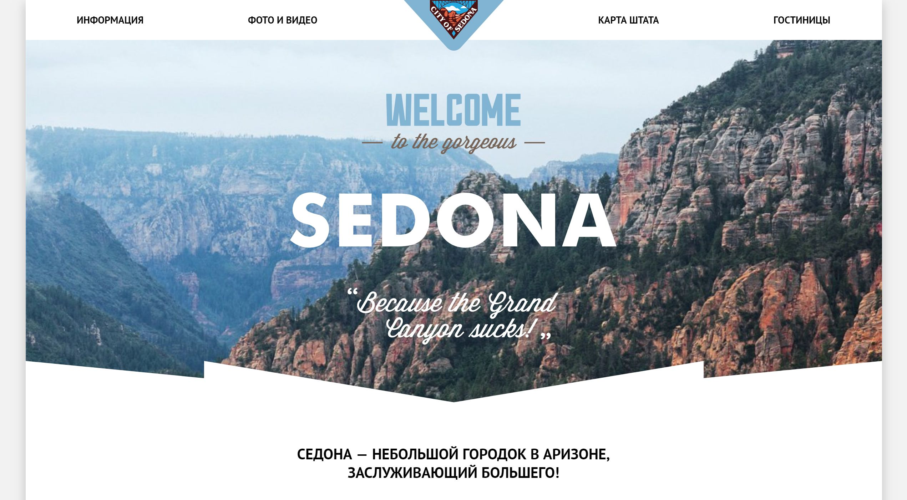

# Личный проект «Седона»
Сделано с любовью ❤️🛤

* Студент: [Вячеслав Акулов](https://up.htmlacademy.ru/htmlcss/23/user/909803).
* Наставник: 🤷🏻‍♂️.

---

---

Репозиторий создан для обучения на профессиональном онлайн‑курсе «[HTML и CSS, уровень 1](https://htmlacademy.ru/intensive/htmlcss)» от [HTML Academy](https://htmlacademy.ru).
